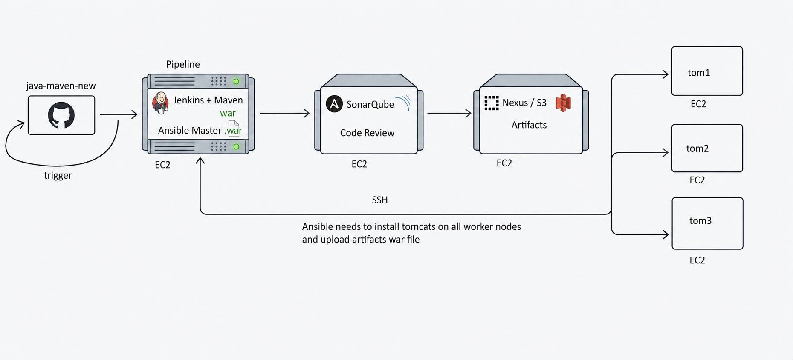

# 🔄 End-to-End CI/CD Pipeline — Jenkins + Maven + Ansible + SonarQube + Nexus + Tomcat on AWS

A production-grade, fully automated CI/CD pipeline that integrates **Jenkins, Maven, Ansible, SonarQube, Nexus, and Apache Tomcat** on AWS EC2 instances. The pipeline automatically pulls Java source code from GitHub, compiles and tests it, performs code quality analysis, stores the artifact, and deploys the WAR file to multiple Tomcat servers using Ansible playbooks.

---

## 📌 Project Overview

| Field | Details |
|---|---|
| **Type** | Personal Project |
| **Domain** | DevOps / CI-CD |
| **Duration** | 2026 |
| **Developer** | Subham Bidhan Sahoo |
| **Complexity** | High |

---

## 🏗️ Architecture Diagram



```
GitHub (java-maven-new)
        |
        | Code Push / Trigger
        ▼
Jenkins + Maven + Ansible Master (EC2 - t3.small)
        |
        |── stage: checkout  → git pull from GitHub
        |── stage: compile   → mvn compile
        |── stage: test      → mvn test
        |── stage: package   → mvn clean package → myapp.war
        |── stage: sonar     → SonarQube code analysis
        |── stage: nexus     → Upload WAR to Nexus Repository
        |── stage: deploy    → Ansible playbook → Copy WAR to Tomcat servers
        |
        |── SSH (Ansible) ──────────────────────────────────────┐
        |                                                        |
        ▼                           ▼                           ▼
  Tomcat Server 1            Tomcat Server 2            Tomcat Server 3
  (EC2 - t2.micro)           (EC2 - t2.micro)           (EC2 - t2.micro)
  Port: 8080                 Port: 8080                 Port: 8080

SonarQube Server (EC2 - t2.medium) → Port: 9000
Nexus Repository Server (EC2 - t2.medium) → Port: 8081
S3 Bucket → WAR file backup storage
```

---

## 🔧 Tech Stack

| Tool/Service | Purpose |
|---|---|
| **GitHub** | Source code repository |
| **Jenkins** | CI/CD orchestration and pipeline management |
| **Maven** | Java build tool — compile, test, package WAR |
| **Ansible** | Configuration management — Tomcat setup + WAR deployment |
| **Apache Tomcat** | Java application server for WAR deployment |
| **SonarQube** | Static code quality analysis and vulnerability detection |
| **Nexus Repository** | Artifact storage for WAR files (maven2 hosted) |
| **AWS S3** | WAR file backup storage |
| **AWS EC2** | Infrastructure for all servers |

---

## 📂 Project Structure

```
Jenkins-Ansible-CICD/
│
├── Jenkinsfile                     # Complete Jenkins pipeline (all stages)
├── ansible/
│   ├── tomcat.yml                  # Ansible playbook — Install & configure Tomcat
│   ├── deploy.yml                  # Ansible playbook — Deploy WAR to Tomcat servers
│   ├── tomcat-users.xml            # Tomcat user roles configuration
│   └── context.xml                 # Tomcat context configuration
│
├── installation/
│   ├── Ansible.sh
│   ├── Jenkins.sh
│   ├── Nexus.sh
│   └── Sonarqube.sh
|
├── architecture/
│   └── cicd_architecture.png       # Architecture diagram
│
└── README.md
```

---

## ⚙️ Infrastructure Setup

### EC2 Instances Required

| Instance | Type | Purpose |
|---|---|---|
| Jenkins + Ansible Master | t3.small | Jenkins server + Ansible control node |
| SonarQube Server | t2.medium | Code quality analysis |
| Nexus Repository Server | t2.medium | Artifact storage |
| Tomcat Server 1 | t2.micro | Application deployment target |
| Tomcat Server 2 | t2.micro | Application deployment target |
| Tomcat Server 3 | t2.micro | Application deployment target |

---

## 🚀 Pipeline Stages


---

## 🎯 Key Outcomes

- ✅ Fully automated CI/CD pipeline — code push to GitHub triggers entire pipeline automatically
- ✅ Automated code quality gate using SonarQube before artifact creation
- ✅ Centralized artifact management with Nexus Repository
- ✅ Zero-touch deployment to multiple Tomcat servers via Ansible playbooks
- ✅ WAR file backup stored in AWS S3
- ✅ Ansible eliminates manual SSH login to each server for deployment
- ✅ PM2-equivalent reliability using systemd service for Tomcat auto-restart

---

## 🔌 Jenkins Plugins Required

- Git Plugin
- Maven Integration
- Ansible Plugin
- SonarQube Scanner
- Sonar Quality Gates
- Nexus Artifact Uploader
- S3 Publisher
- Pipeline: AWS Steps

---

## 👨‍💻 Developer

**Subham Bidhan Sahoo**
- GitHub: [github.com/SubhamBidhan](https://github.com/SubhamBidhan)
- LinkedIn: [linkedin.com/in/subhambidhan](https://linkedin.com/in/subhambidhan)
